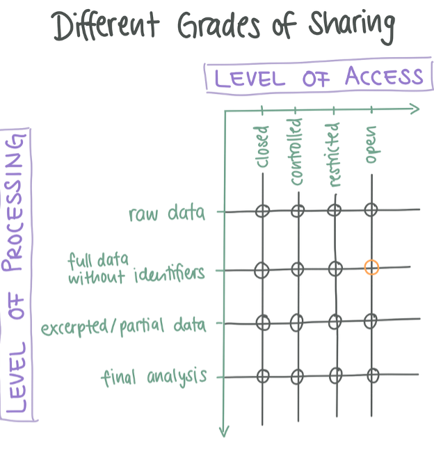
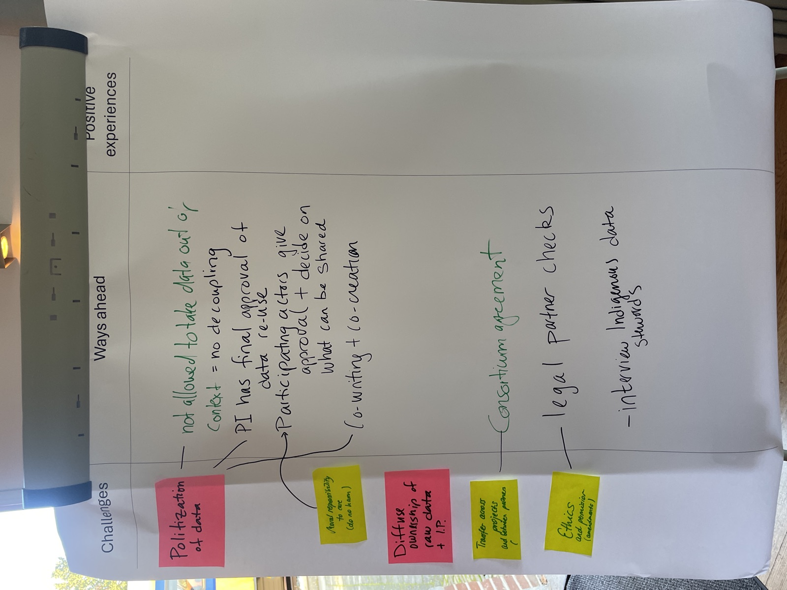

## Where does your data live after the project? {.center}

::: {.big-question}
A folder on the lab server is not the end of the road.
:::

::: {.notes}
Set up the block: after a Td project ends, the data needs a home that outlives the project, the people, and the website. This is the "where" part of data governance. 10 minutes, then we open it to the group.
:::

## Why not just the lab-server folder?

::: {.columns}
::: {.column width="55%"}
- **No permanent link.** Nobody can cite it or find it again.
- **Invisible.** Only your group knows it exists.
- **Fragile.** It is lost when servers, staff, or websites change.
:::
::: {.column width="45%"}
{.rounded}

::: {.img-credit}
Photo: FAIRqual team, ITD24 workshop (Nov 2024). Project asset.
:::
:::
:::

::: {.notes}
The lab server covers the active project phase. It does none of the things below for anyone outside the group. ETH says the same in RSETHZ 414.2.
:::

## What a repository gives you

::: {.columns}
::: {.column width="60%"}
- **DOI** – a permanent identifier that keeps working and can be cited.
- **Visibility** – a public catalogue, searchable even when the files are closed.
- **Managed access** – rules, request forms, contracts, a record of who got the data.
- **Preservation** – files kept readable and backed up beyond the project.
:::
::: {.column width="40%"}
::: {.repo-card}
DOI · catalogue · access rules · backup
:::
:::
:::

::: {.notes}
Contrast with emailing copies: you lose control over what happens next. A repository is a service, not a hard drive.
:::

## Two questions decide how you share

::: {.columns}
::: {.column width="44%"}
{.grid-img fig-alt="Grid of grades of sharing: level of access on the x-axis (closed to open), level of processing on the y-axis (raw data to final analysis). An orange circle marks full data without identifiers, shared openly."}
:::
::: {.column width="52%"}
- **Access** – how easily can someone reach it? *(closed -> open)*
- **Processing** – which work steps do you share? *(raw -> final)*

Your dataset is one point. The orange circle: **full data without identifiers**, shared **openly**.
:::
:::

::: {.axis-caption}
Figure: FAIRqual OER module (Unit 4.3.1). Example: Mohr et al. 2026. Based on Table 2, Alexander et al. 2020.
:::

::: {.notes}
The orange circle is one choice: "full data without identifiers" in an "open" setting, like the FAIRqual ITD24 dataset (Mohr et al. 2026). Every dataset sits somewhere on this grid; the rest of the talk is how repositories let you pick the point. Note the axes: access runs closed-to-open along the top, processing runs raw-to-final down the side.
:::

## Three kinds of repository

- **Institutional** – for members of one institution. At ETH: the **ETH Research Collection**.
- **Disciplinary** – field-specific curation and access. For qualitative / social-science data in Switzerland: **SWISSUbase** (run by FORS).
- **Generalist** – accepts data from any field, e.g. **Zenodo**.

```{=html}
<div class="logo-row">
  <div class="logo-cell"></div>
  <div class="logo-cell"></div>
  <div class="logo-cell"></div>
</div>
```

::: {.key-banner .fragment}
SWISSUbase is the qualitative home: certified (CoreTrustSeal), assigns DOIs, accepts sensitive data, kept under Swiss law.
:::

::: {.notes}
Most people default to Zenodo because it is easy. For sensitive qualitative data, the disciplinary option is usually the better fit.
:::

## The access axis, up close

The "closed -> open" axis from the grid is not a switch. Repositories give you rungs in between.

```{=html}
<div class="access-stair">
  <div class="stair-axis"><span class="ax-open">OPEN</span><span class="ax-closed">CLOSED</span></div>
  <div class="stair-rungs">
    <div class="srung s1"><span class="lbl">Open</span> anyone downloads, open licence, no registration</div>
    <div class="srung s2"><span class="lbl">Standard conditions</span> register &amp; accept terms <em>(automatic)</em></div>
    <div class="srung s3"><span class="lbl">Individual approval</span> a named person decides each request</div>
    <div class="srung s4"><span class="lbl">Secure / on-site</span> the data never leaves a controlled space</div>
  </div>
</div>
```

::: {.axis-caption}
Concrete: SWISSUbase can restrict to academic research; the ETH Research Collection can restrict files to logged-in ETH members.
:::

::: {.notes}
This is the access axis from the previous grid, as repositories actually implement it. Callback to slide 4: same axis, now made concrete. Note it is a ladder, not a switch: you are not stuck with all-open or all-closed. The next two slides zoom into this ladder: rung 2 vs rung 3 is "automatic vs manual", and rung 4 is "giving access without giving the data".
:::

## Automatic vs manual

::: {.columns}
::: {.column width="50%"}
**Automatic rules**

- Embargo date, academic-research-only.
- No one reviews the request.
:::
::: {.column width="50%"}
**Manual (sur dossier)**

- A named person approves each request.
- Must stay reachable for **years** after the project ends.
:::
:::

::: {.key-banner .fragment}
Manual approval works only if the role sits with a **function** (e.g. a data steward). Otherwise, choose automatic rules.
:::

::: {.notes}
This is the practical trap for park work: "I'll approve requests myself" does not survive staff turnover. Tie the approver to a role, not a person, or go automatic.
:::

## Licence vs data-use agreement

::: {.columns}
::: {.column width="50%"}
**Creative Commons licence**

- Covers copyright.
- Granted in advance, cannot be revoked.
- Does **not** cover personal data.
- Use CC / CC0 for fully anonymised open data.
:::
::: {.column width="50%"}
**Data-use agreement**

- A contract with each user.
- Limits purpose, forbids passing on.
- Forbids re-identification, requires deletion.
- Qualitative data usually needs this.
:::
:::

::: {.key-banner .fragment}
Neither can be more open than what participants consented to.
:::

::: {.notes}
SWISSUbase publishes a Standard Download Contract as a public example of a DUA. The consent ceiling is the hard rule: you cannot license or open data beyond what people agreed to.
:::

## Giving access without giving the data

::: {.columns}
::: {.column width="55%"}
- **Reading-room access**: approved visitors consult the full material on site, no copies (e.g. ETH Archives of Contemporary History).
- **Share the process, not the data**: lower the processing level: excerpts, codebooks, documentation of decisions.
:::
::: {.column width="45%"}
{.rounded}

::: {.img-credit}
Photo: Carol M. Highsmith, public domain ([Library of Congress, via Wikimedia Commons](https://commons.wikimedia.org/wiki/File:LOC_Main_Reading_Room_Highsmith.jpg)).
:::
:::
:::

::: {.notes}
When no access level fits the data, move along the other axis instead: share what describes the data (metadata, documentation) even when the data itself stays closed. This loops back to "levels of processing".
:::

## Over to you {.center}

::: {.big-question}
Which "places" suit which of your data?
:::

::: {.columns}
::: {.column width="55%"}
On your post-its: name a dataset, then place it on the grid (how open, how processed) and which repository or archive fits.
:::
::: {.column width="45%"}
{.rounded}

::: {.img-credit}
Photo: FAIRqual team, from the *dataitd24* package (CC BY 4.0). <https://doi.org/10.5281/zenodo.18493525>
:::
:::
:::

::: {.notes}
Hand to the group exercise. Encourage them to add "places" beyond the three repository types: reading rooms, project websites, documentation-only shares.
:::

## References

- FAIRqual OER module, Subsection 4.3 *Practical Aspects of Sharing Qualitative Data* (Units 4.3.1–4.3.3). In preparation.
- Alexander, S. M., Jones, K., Bennett, N. J. et al. (2020). Qualitative data sharing and synthesis for sustainability science. *Nat Sustain* 3, 81–88. <https://doi.org/10.1038/s41893-019-0434-8>
- Mohr, F., Chapman, M., Pohl, C. et al. (2026). *dataitd24* (v1.0.0) [Data set]. Zenodo. <https://doi.org/10.5281/zenodo.18493525>
- ETH Zurich data management guidelines (RSETHZ 414.2); SWISSUbase Standard Download Contract.

## Thanks {#thanks}

::: {.columns}
::: {.column width="50%"}

::: {.kicker}
Contact
:::

- **Lars Schöbitz**, Global Health Engineering, ETH Zurich
- **The FAIRqual project:** [fairqual.org](https://fairqual.org)
- **These slides:** built with Quarto and reveal.js

:::
::: {.column width="50%"}

::: {.kicker}
Resources
:::

- **Certified qualitative repository:** [SWISSUbase](https://www.swissubase.ch) (FORS)
- **ETH Research Collection:** [research-collection.ethz.ch](https://www.research-collection.ethz.ch)
- **Example dataset:** [dataitd24 on Zenodo](https://doi.org/10.5281/zenodo.18493525) and curated as [a standalone website](https://fairqual.github.io/dataitd24/)

:::
:::

::: {.thanks-foot}
All material is licensed under Creative Commons Attribution 4.0 International (CC BY 4.0).
:::

::: {.notes}
Close the block. Everything here is open. The repository types from earlier map to the resources: SWISSUbase for sensitive qualitative data, the ETH Research Collection for ETH members, Zenodo as the generalist fallback.
:::
