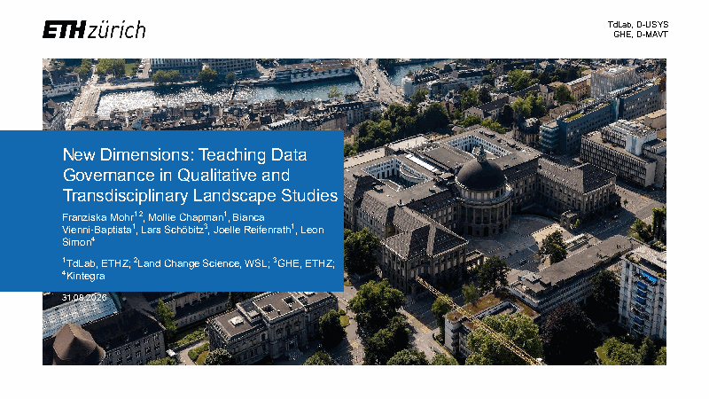
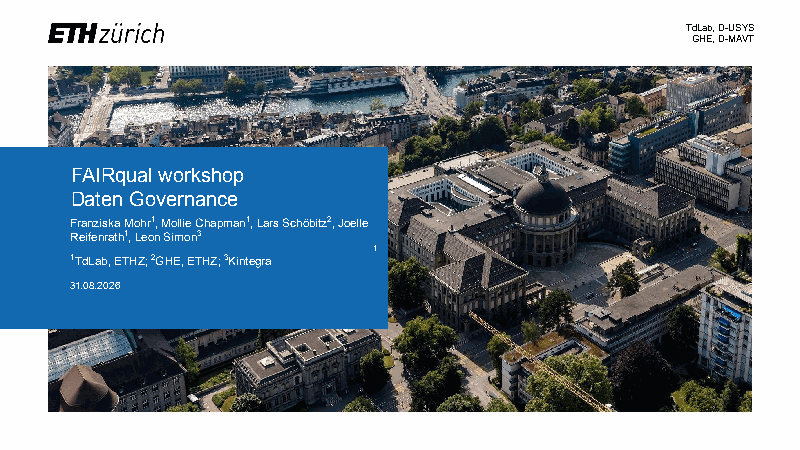
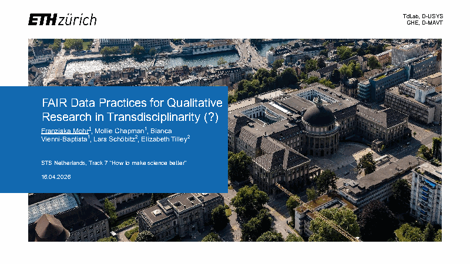

::: {.fq-hero}
::: {.fq-section}

# FAIR data practices for qualitative research in transdisciplinarity

<p class="fq-lead">FAIRqual explores how to make FAIR data practices part of qualitative data management in transdisciplinary research. Qualitative data raises ethical and confidentiality questions that make open sharing hard, yet shared data can help researchers learn from each other's projects. We run workshops and expert interviews and build technical workflows for sharing qualitative data.</p>

::: {.fq-actions}
[Explore outputs & data](outputs/index.qmd){.btn .btn-primary}
[See the slides](gallery/slides/index.qmd){.btn .btn-outline}
:::

:::
:::

::: {.fq-section}

## Dataset

::: {.fq-dataset}
::: {.fq-dataset-text}
**dataitd24** holds the data from our workshop at the International Transdisciplinary Conference (ITD24) in Utrecht in November 2024. In four groups, 24 researchers wrote on flipcharts and post-it notes how they collect and share qualitative data, and what worries them about sharing it. We coded all notes into 50 codes in seven categories. The types of data people work with came up most often, e.g., interviews and workshops. Reasons for sharing and fears about sharing came next.

[Open dataitd24](https://fairqual.github.io/dataitd24/){.fq-more}
[All outputs & data](outputs/index.qmd){.fq-more}
:::

::: {.fq-dataset-chart}

<p class="fq-chart-title">Types of data came up most often</p>
<p class="fq-chart-note">How often the codes in each category appeared in the workshop notes.</p>

```{r}
#| label: dataset-chart
#| dev: ragg_png
#| dev.args: !expr list(bg = "transparent")
#| fig-width: 4.8
#| fig-height: 3.2
#| fig-dpi: 220
#| fig-alt: "Horizontal bar chart of how often the codes in each category appeared in the ITD24 workshop notes. Types of qualitative data 91, why share 51, fears and challenges of sharing 44, data sharing approaches 38, data sovereignty 28, ways of sharing qualitative data 25, how to navigate AI 6."
# pak::pak("fairqual/dataitd24")
library(dataitd24)
library(dplyr)
library(ggplot2)

category_labels <- c(
  "data types" = "Types of qualitative data",
  "why share? Practical aspects of sharing" = "Why share?",
  "fears / direct challenges of sharing" = "Fears and challenges of sharing",
  "data sharing approaches" = "Data sharing approaches",
  "data sovereignty" = "Data sovereignty",
  "ways of sharing qualitative data" = "Ways of sharing qualitative data",
  "how to navigate ai?" = "How to navigate AI?"
)

categories <- codebook_qualitative |>
  summarise(mentions = sum(frequency), .by = category) |>
  mutate(label = category_labels[category]) |>
  arrange(mentions) |>
  mutate(label = factor(label, levels = label))

ggplot(categories, aes(x = mentions, y = label)) +
  geom_col(fill = "#0081A7", width = 0.55) +
  geom_text(aes(label = mentions), hjust = -0.25, size = 4.4,
            colour = "#1e1e1e", family = "Atkinson Hyperlegible Next") +
  scale_x_continuous(expand = expansion(mult = c(0, 0.14))) +
  labs(x = NULL, y = NULL) +
  theme_minimal(base_size = 13, base_family = "Atkinson Hyperlegible Next") +
  theme(
    panel.grid = element_blank(),
    axis.text.x = element_blank(),
    axis.text.y = element_text(colour = "#1e1e1e", size = 12.5, hjust = 1),
    plot.background = element_rect(fill = "transparent", colour = NA),
    plot.margin = margin(0, 4, 0, 0)
  )
```

:::
:::

:::

::: {.fq-tint}
::: {.fq-section}

## Slides

<p class="fq-lead">Talks and workshops where we presented FAIRqual.</p>

```{=html}
<div class="fq-cards">
<a class="fq-card" href="gallery/slides/index.qmd#pecsrl-2026"><div class="fq-card-body"><span class="fq-card-kicker">September 2026, Ghent</span><strong>PECSRL 2026: New Dimensions: Teaching Data Governance in Qualitative and Transdisciplinary Landscape Studies</strong><p>The FAIRqual project and the e-learning course, in a session on educating landscape geographers.</p></div></a>
<a class="fq-card" href="gallery/slides/index.qmd#jurapark-2026"><div class="fq-card-body"><span class="fq-card-kicker">August 2026, workshop</span><strong>FAIRqual Workshop 2026: Data Repositories und Mehr</strong><p>A data governance workshop in German, with the workshop deck, the input slides and a handout.</p></div></a>
<a class="fq-card" href="gallery/slides/index.qmd#sts-nl-2026"><div class="fq-card-body"><span class="fq-card-kicker">April 2026, University of Twente</span><strong>STS NL 2026: FAIR Data Practices for Qualitative Research in Transdisciplinarity</strong><p>How data governance and FAIR data practices in qualitative research could help make science better.</p></div></a>
</div>
```

[All slides](gallery/slides/index.qmd){.fq-more}

:::
:::

::: {.fq-section}

## Blog

<p class="fq-lead">News and reflections from the project.</p>

::: {#latest-posts}
:::

[All posts](blog/index.qmd){.fq-more}

:::

::: {.fq-band}
::: {.fq-band-inner}

## Get in touch

If you have questions about FAIRqual or about sharing qualitative data in your own project, write to Mollie Chapman at [mollie.chapman@usys.ethz.ch](mailto:mollie.chapman@usys.ethz.ch?subject=FAIRqual request). You can follow our work on [GitHub](https://github.com/fairqual).

:::
:::
